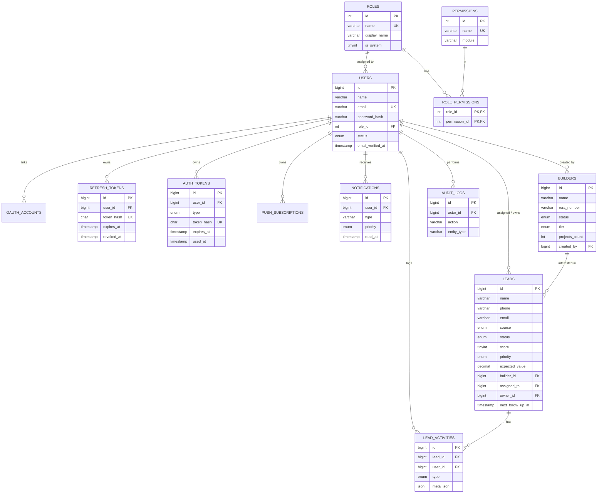

# MPF CRM — Database Schema & ER Diagram

MySQL 8, InnoDB, `utf8mb4`. Full DDL: [`backend/src/db/schema.sql`](../backend/src/db/schema.sql).

## ER Diagram



## Tables

| Table                | Purpose                                                        |
|----------------------|---------------------------------------------------------------|
| `roles`              | RBAC roles (super_admin … customer_support)                   |
| `permissions`        | Granular permissions (`leads.create`, `builders.read`, …)     |
| `role_permissions`   | Many-to-many role ↔ permission (configurable at runtime)      |
| `users`              | Team members, linked to a role                                |
| `oauth_accounts`     | Linked Google/Facebook/Microsoft identities (future)         |
| `refresh_tokens`     | Hashed, rotating refresh tokens for sessions                  |
| `auth_tokens`        | Single-use email-verify & password-reset tokens              |
| `builders`           | Developer/promoter partners, with tier + RERA + projects      |
| `leads`              | Core lead records with pipeline status, score, assignment     |
| `lead_activities`    | Per-lead timeline (notes, calls, status changes, assignments) |
| `notifications`      | In-app notification center items                              |
| `push_subscriptions` | FCM web-push tokens (future)                                  |
| `audit_logs`         | Immutable audit trail of key actions                          |

## Key indexes
- `leads`: `status`, `source`, `assigned_to`, `next_follow_up_at`, `phone`, plus a FULLTEXT index on `(name,email,phone,location_pref,city)`.
- `builders`: `status`, `city`, FULLTEXT on `(name,legal_name,city,contact_person)`.
- `notifications`: `(user_id, read_at, created_at)` for fast unread queries.

## Lead pipeline stages
`new → contacted → qualified → site_visit → negotiation → booked` (with `lost` as a terminal branch), matching the SRS.

## Setup
```bash
mysql -u root -p < backend/src/db/schema.sql   # or: npm run db:migrate
npm run db:seed                                 # roles, permissions, admin, demo data
```
